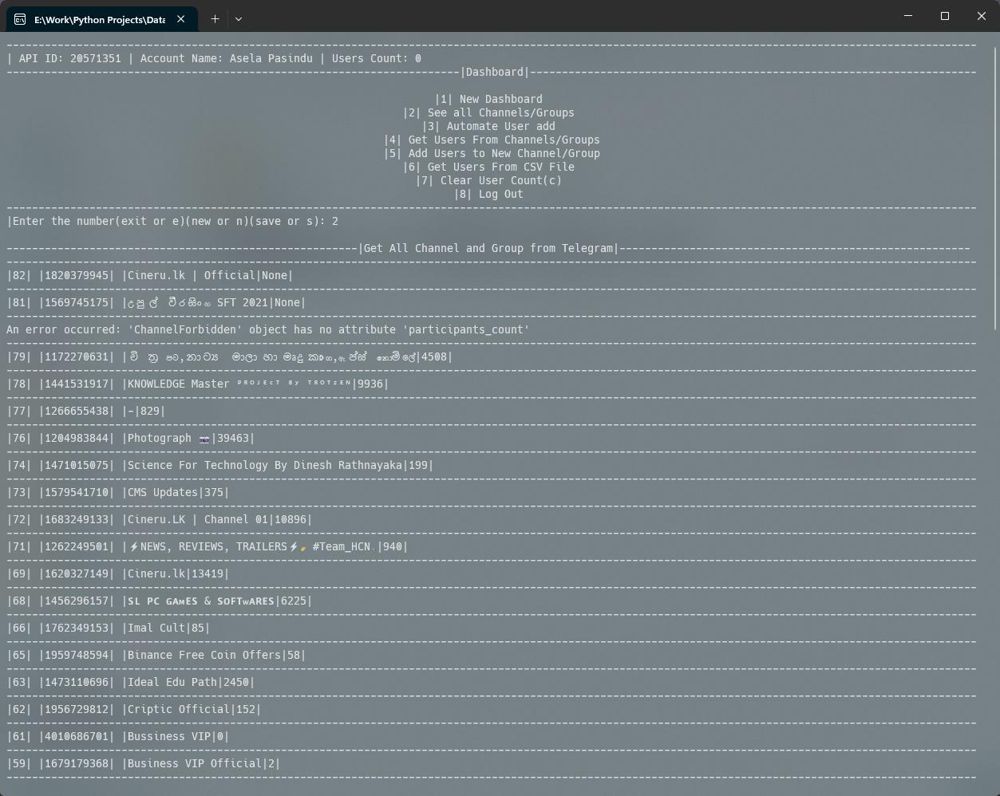

# Data Scraping Software for Telegram(CLI)

Developed a tool specifically for Telegram to extract user data. Key features include listing Telegram channels/groups, automating user addition, and managing users via CSV files for seamless data handling.



## Get Start With Project.

This CLI tool, developed using Python and the Telethon library, provides robust functionality for managing Telegram channels and groups members:
-   **Automatic Connection**: Effortlessly connects to Telegram.
-   **Multi-Account Management**: Seamlessly handles multiple telegram accounts.
-   **Member/Users Export**: Exports group or channel members into CSV files for efficient data management.
-   **Member/Users Import**: Imports members to groups or channels using CSV files.
-   **Automate Member/Users Transfer**: Transfers members between groups or channels with ease.

### Folder Structure

```bash
├── Data_Scraping_Software
│   ├── Telegram_Data_Scraping
│   ├── Data - (Auto Generate)
│   ├── Save CSV(default) - (Auto Generate)
│   ├── .gitignore
│   ├── icon.ico
│   ├── Pipfile
│   ├── Pipfile.lock
│   ├── README.md
│   ├── requirements.txt
│   ├── setup.py
└── └── setup.spec
```

### How To Run

You can run the program by using this command.
```bash
py setup.py
```
or
```bash
python setup.py
```
or
```bash
python3 setup.py
```

### Generate .EXE file

To generate an executable file, use the PyInstaller library. The code is designed to be compatible with PyInstaller, allowing you to generate a  `.exe`  file with a single command.

```bash
pyinstaller setup.spec
```
or, to generate the  `.exe`  file with more control, you can use the following command:
```bash
pyinstaller --name setup --onefile --icon=icon.ico setup.py
```
You can customize the app's icon by replacing it with your desired icon file.

> **Note:**  The icon file must be located in the root directory of the project for PyInstaller to detect it correctly.